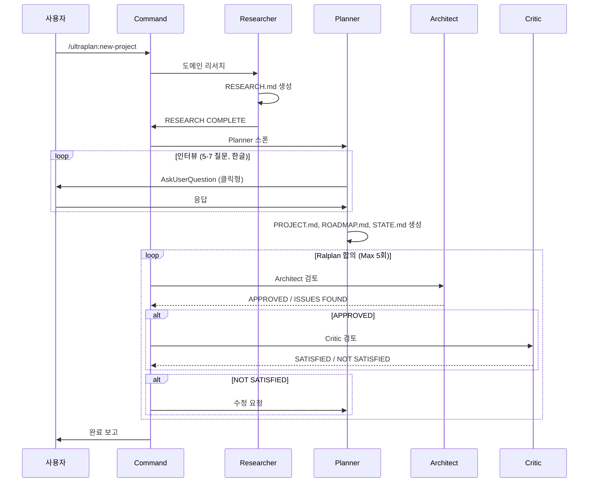
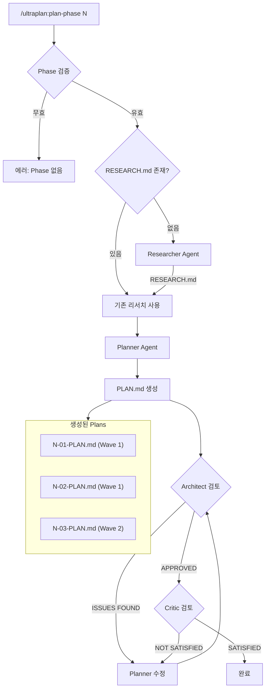
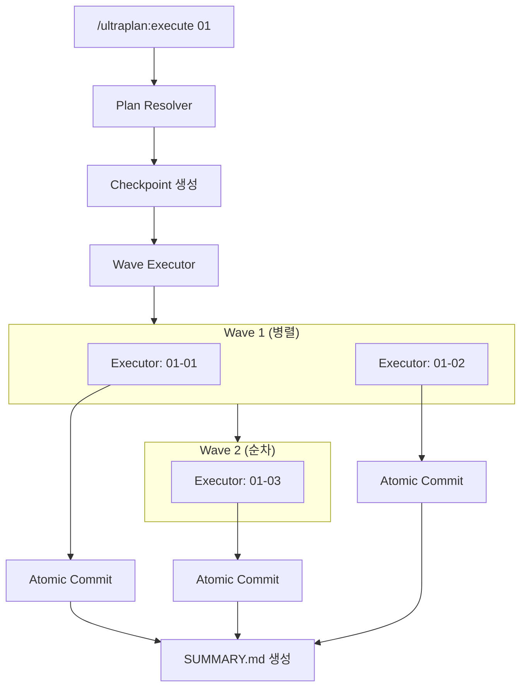

# Ultra Planner v2

GSD + OMC + OpenCode 패턴을 통합한 Claude Code용 계획-실행 오케스트레이션 시스템.

## 특징

- **Research → Plan → Ralplan 워크플로우**: 리서치 후 계획, Architect + Critic 합의까지 검증
- **인터뷰 기반 계획**: Planner 에이전트가 한글로 질문하고 계획 수립
- **병렬 실행**: Wave 기반 태스크 병렬 처리 (Ultrapilot 패턴)
- **MCP 서버**: TypeScript 라이브러리를 MCP 도구로 노출
- **에러 복구**: 자동 롤백 + 재시도 (Ralph Loop 패턴)
- **Atomic Commit**: 태스크별 자동 커밋

## 설치

### 개인용 전역 설치 (권장)

```bash
# 1. 디렉토리 생성
mkdir -p ~/.claude/commands ~/.claude/agents ~/.claude/skills

# 2. 심볼릭 링크 생성
ln -sf /path/to/ultra-planning/.claude/commands/* ~/.claude/commands/
ln -sf /path/to/ultra-planning/.claude/agents/* ~/.claude/agents/
ln -sf /path/to/ultra-planning/.claude/skills/ultraplan ~/.claude/skills/

# 3. 확인
ls ~/.claude/commands/ultraplan*
```

### 프로젝트별 설치

```bash
# 특정 프로젝트에만 설치
cp -r /path/to/ultra-planning/.claude /your/project/
```

### MCP 서버 설정

다른 프로젝트에서 Ultra Planner 함수를 MCP 도구로 사용:

```json
// .mcp.json
{
  "mcpServers": {
    "ultra-planner": {
      "type": "stdio",
      "command": "npx",
      "args": ["tsx", "/home/ubuntu/code/ultra-planning/src/mcp-server.ts"]
    }
  }
}
```

## 사용법

### 기본 워크플로우

```
┌─────────────────────────────────────────────────────────────┐
│  Ultra Planner 워크플로우                                    │
│                                                              │
│  1. RESEARCH — 프로젝트/페이즈 도메인 리서치                  │
│  2. PLAN — 인터뷰 + PROJECT.md, ROADMAP.md, PLAN.md 생성     │
│  3. RALPLAN — Architect + Critic 합의까지 검증               │
│  4. EXECUTE — Wave 기반 병렬 실행                            │
└─────────────────────────────────────────────────────────────┘
```

```bash
# 1. 새 프로젝트 시작 (Research → 인터뷰 → Ralplan 검증)
/ultraplan:new-project

# 2. Phase 계획 생성 (Research → Plan → Ralplan 검증)
/ultraplan:plan-phase 1

# 3. Plan 실행
/ultraplan:execute 01-01
```

### 슬래시 커맨드

| 명령어 | 설명 |
|--------|------|
| `/ultraplan:new-project` | 새 프로젝트 초기화 (Research → Plan → Ralplan) |
| `/ultraplan:plan-phase {N}` | Phase N의 PLAN.md 파일들 생성 (Research → Plan → Ralplan) |
| `/ultraplan:execute {plan}` | Plan 실행 (예: `01-01`, `02`) |
| `/ultraplan:status` | 현재 프로젝트 상태 확인 |

### 플래그

```bash
/ultraplan:new-project --skip-research    # 리서치 건너뛰기
/ultraplan:plan-phase 1 --skip-research   # 리서치 건너뛰기
/ultraplan:plan-phase 1 --skip-verify     # Ralplan 검증 건너뛰기
/ultraplan:plan-phase 1 --gaps            # 갭 클로저 모드
```

## 아키텍처

### 에이전트 구조

```
┌─────────────────────────────────────────────────────────────┐
│                         AGENTS                               │
├─────────────────────────────────────────────────────────────┤
│  Researcher (Opus)  │ 도메인 리서치, RESEARCH.md 생성        │
│  Planner (Opus)     │ 인터뷰, PROJECT/ROADMAP/PLAN.md 생성   │
│  Architect (Opus)   │ 계획 검토, 기술적 타당성 검증           │
│  Critic (Opus)      │ 가정 도전, 리스크 식별                  │
│  Executor (Sonnet)  │ 태스크 실행, 코드 작성                  │
└─────────────────────────────────────────────────────────────┘
```

### Ralplan 합의 루프

```
┌──────────────────────────────────────────────────────────────┐
│                    CONSENSUS LOOP (Max 5회)                   │
│                                                               │
│   ┌──────────┐    ┌───────────┐    ┌────────┐                │
│   │ Planner  │───▶│ Architect │───▶│ Critic │                │
│   └──────────┘    └───────────┘    └────────┘                │
│        ▲                               │                      │
│        │         NOT SATISFIED         │                      │
│        └───────────────────────────────┘                      │
│                                                               │
│   종료 조건: Architect APPROVED + Critic SATISFIED            │
└──────────────────────────────────────────────────────────────┘
```

### 시나리오 1: 새 프로젝트 초기화



### 시나리오 2: Phase 계획 생성



### 시나리오 3: Plan 실행 (Wave 병렬화)



## 디렉토리 구조

### 설치 파일 (공유됨)

```
.claude/
├── commands/                    # 슬래시 커맨드 정의
│   ├── ultraplan-new-project.md
│   ├── ultraplan-plan-phase.md
│   ├── ultraplan-execute.md
│   └── ultraplan-status.md
├── agents/                      # 에이전트 정의
│   ├── ultraplan-planner.md     # 인터뷰 + 계획 (한글)
│   ├── ultraplan-researcher.md  # 도메인 리서치
│   ├── ultraplan-architect.md   # 기술 검토
│   ├── ultraplan-critic.md      # 가정 도전
│   └── ultraplan-executor.md    # 태스크 실행
└── skills/ultraplan/            # 스킬 및 참조 문서
    ├── SKILL.md
    ├── templates/
    └── references/
```

### 프로젝트 계획 파일 (프로젝트별 독립)

```
your-project/
└── .planning/
    ├── PROJECT.md               # 프로젝트 정의
    ├── ROADMAP.md               # Phase 목록 + 진행 상황
    ├── STATE.md                 # 현재 상태
    └── phases/
        ├── 01-foundation/
        │   ├── 01-RESEARCH.md   # 도메인 리서치 결과
        │   ├── 01-01-PLAN.md    # 실행 계획
        │   ├── 01-01-SUMMARY.md # 실행 결과
        │   └── ...
        └── 02-feature/
            └── ...
```

### TypeScript 라이브러리 (src/)

```
src/
├── index.ts                # 메인 엔트리포인트
├── types.ts                # 타입 정의
├── mcp-server.ts           # MCP 서버 (도구 노출)
├── agents/                 # 에이전트 프롬프트 생성
├── context/                # 컨텍스트 수집
├── documents/              # 문서 템플릿 + 생성기
├── git/                    # Atomic commit
├── hooks/                  # 이벤트 훅
├── loops/                  # Ralph Loop
├── notepad/                # 학습 노트패드
├── orchestration/          # 키워드 감지, Ralplan, Ultrapilot
├── quality/                # 품질 파이프라인
├── recovery/               # 에러 복구 + 롤백
├── state/                  # 파일 기반 상태 관리
├── sync/                   # PLAN.md ↔ Tasks 동기화
└── tasks/                  # 태스크 관리
```

## 핵심 모듈

| 모듈 | 위치 | 기능 |
|------|------|------|
| State Manager | `src/state/` | 파일 기반 상태 관리, 이벤트, 체크포인트 |
| Documents | `src/documents/` | PROJECT/ROADMAP/PLAN.md 템플릿 + 생성기 |
| Agents | `src/agents/` | Planner, Researcher, Architect, Critic 프롬프트 |
| Orchestration | `src/orchestration/` | 키워드 감지, Ralplan, Ultrapilot |
| Sync | `src/sync/` | PLAN.md ↔ Claude Tasks 동기화 |
| Recovery | `src/recovery/` | 에러 복구 + Git 롤백 |
| Git | `src/git/` | Atomic commit |
| Ralph Loop | `src/loops/ralph/` | 완료 감지 + 상태 관리 |
| Notepad | `src/notepad/` | 학습 노트, 결정 사항 기록 |
| Quality | `src/quality/` | LSP 진단, AST 분석, 코드 리뷰 |

## API 예시

### 상태 관리

```typescript
import { readState, writeState, createCheckpoint } from 'ultra-planner';

// 상태 읽기/쓰기
const state = await readState('my-state');
await writeState('my-state', { phase: 1, status: 'in_progress' });

// 체크포인트
await createCheckpoint('before-risky-operation');
await rollbackToCheckpoint('before-risky-operation');
```

### 문서 생성

```typescript
import { generateProjectMd, generateRoadmapMd, generatePlanMd } from 'ultra-planner';

// PROJECT.md 생성
const projectMd = generateProjectMd({
  name: 'My Project',
  description: 'A cool project',
  requirements: [{ id: 'REQ-01', description: 'Feature A' }]
});

// PLAN.md 파싱
const plan = await parsePlanMd('.planning/phases/01-foundation/01-01-PLAN.md');
```

### 노트패드 (학습 기록)

```typescript
import { initPlanNotepad, addLearning, addDecision } from 'ultra-planner';

// 노트패드 초기화
await initPlanNotepad('my-plan');

// 학습 기록
await addLearning('my-plan', 'TypeScript strict mode requires explicit return types');

// 결정 사항 기록
await addDecision('my-plan', 'Use Zod for runtime validation instead of io-ts');
```

## 빌드 및 테스트

```bash
# 의존성 설치
npm install

# 빌드
npm run build

# 테스트
npm test
```

## 아키텍처 원칙

1. **Research First**: 계획 전 항상 도메인 리서치
2. **Ralplan 합의**: Architect + Critic 합의 없이 실행 없음
3. **문서가 곧 프롬프트**: PLAN.md는 실행자에게 직접 전달되는 지시문
4. **Goal-Backward**: 목표에서 역산하여 Phase/Task 도출
5. **Wave 기반 병렬화**: 의존성 없는 태스크는 병렬 실행
6. **Atomic Commit**: 태스크 완료마다 자동 커밋
7. **파일 기반 상태**: 에이전트 간 상태 공유는 파일로

## 참조 프로젝트

- [oh-my-claudecode](https://github.com/anthropics/oh-my-claudecode) - OMC 패턴
- [get-shit-done](https://github.com/anthropics/get-shit-done) - GSD 문서 체계
- [oh-my-opencode](https://github.com/anthropics/oh-my-opencode) - Ralph Loop, Atlas 패턴

## 라이선스

MIT

---

*Ultra Planner v2 - 2026-01-27*
