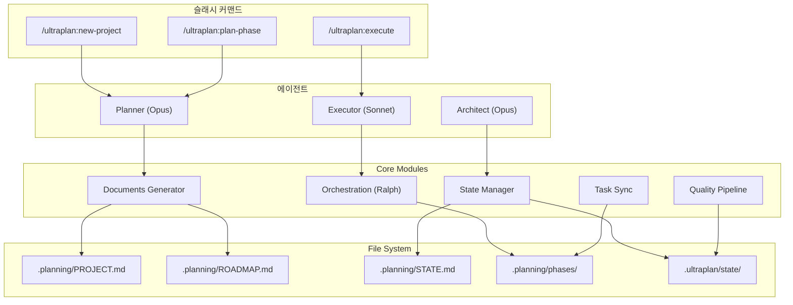
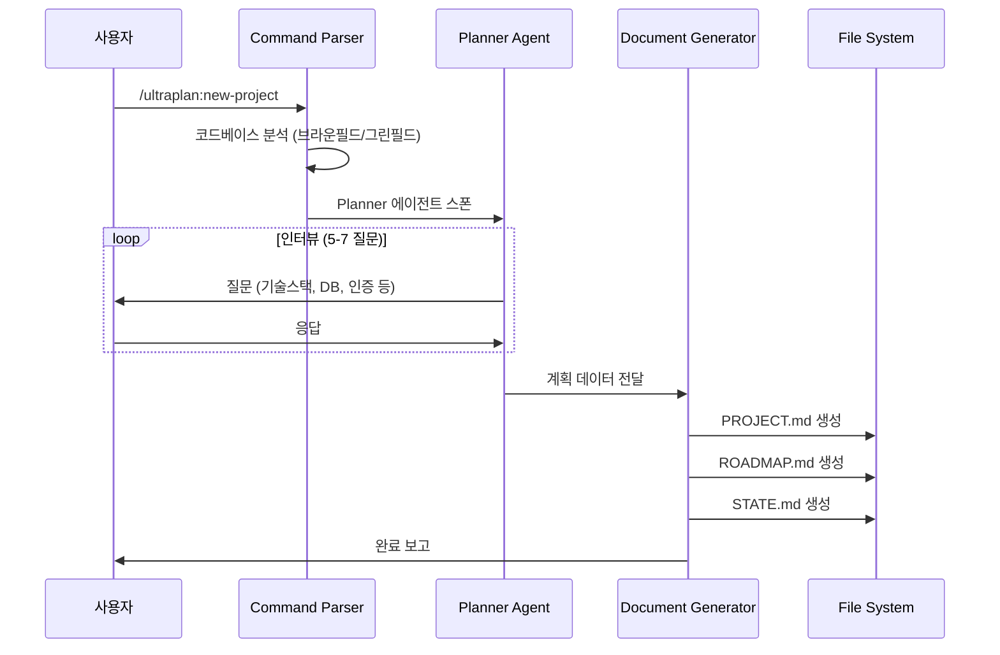
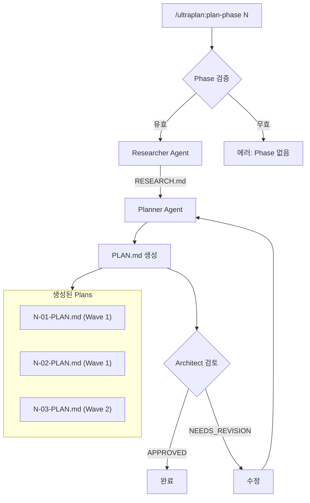
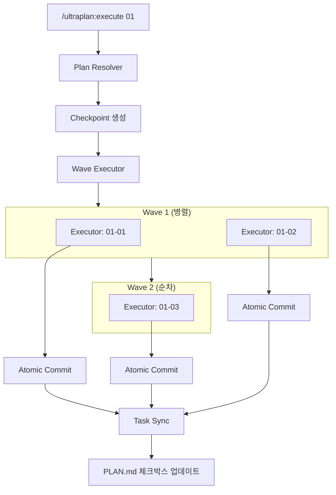
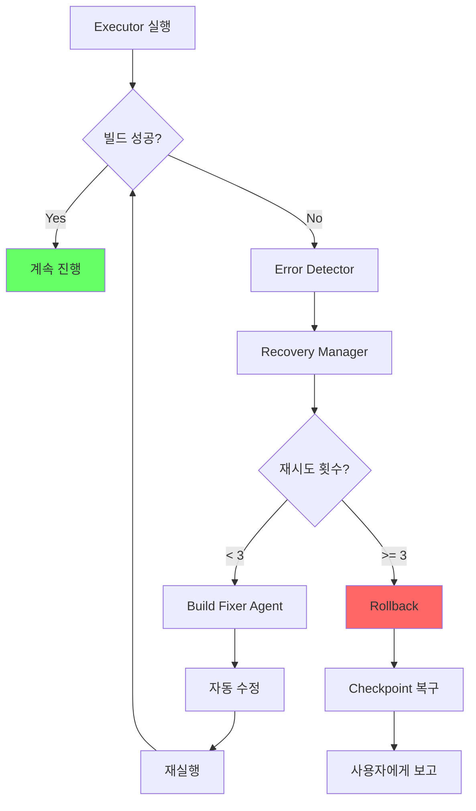
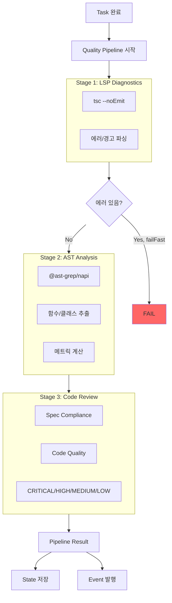
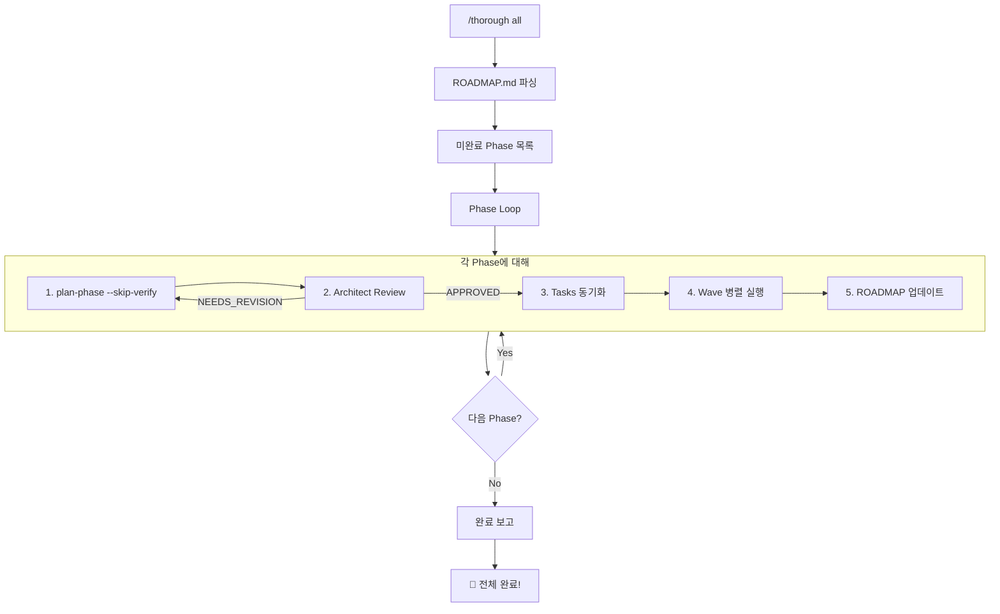
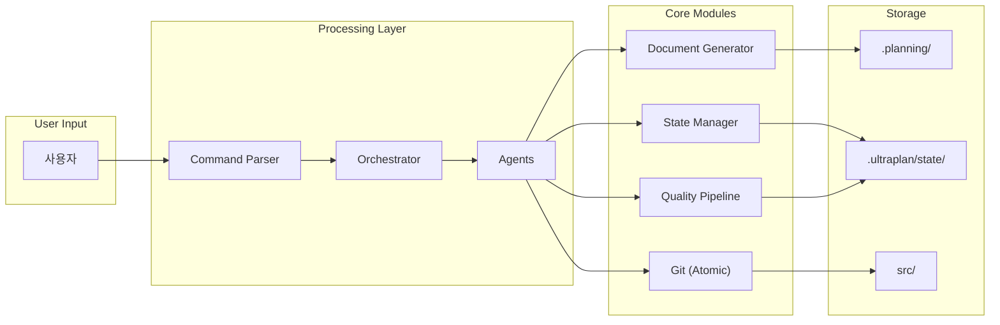

# Ultra Planner v2

GSD + OMC + OpenCode 패턴을 통합한 Claude Code용 계획-실행 오케스트레이션 시스템.

## 특징

- **문서 기반 워크플로우**: PROJECT.md → ROADMAP.md → PLAN.md 자동 생성
- **인터뷰 기반 계획**: Planner 에이전트가 질문하고 계획 수립
- **병렬 실행**: Wave 기반 태스크 병렬 처리 (Ultrapilot 패턴)
- **Claude Tasks 동기화**: PLAN.md ↔ Claude Tasks API 양방향 연동
- **에러 복구**: 자동 롤백 + 재시도 (Ralph Loop 패턴)
- **Atomic Commit**: 태스크별 자동 커밋

## 설치

### 개인용 전역 설치 (권장)

```bash
# 1. 디렉토리 생성
mkdir -p ~/.claude/commands ~/.claude/agents ~/.claude/skills

# 2. 심볼릭 링크 생성
ln -sf /path/to/ultra-planning/.claude/commands/* ~/.claude/commands/
ln -sf /path/to/ultra-planning/.claude/agents/* ~/.claude/agents/
ln -sf /path/to/ultra-planning/.claude/skills/ultraplan ~/.claude/skills/

# 3. 확인
ls ~/.claude/commands/ultraplan*
```

### 프로젝트별 설치

```bash
# 특정 프로젝트에만 설치
cp -r /path/to/ultra-planning/.claude /your/project/
```

## 사용법

### 기본 워크플로우

```bash
# 1. 새 프로젝트 시작 (인터뷰 진행)
/ultraplan:new-project

# 2. Phase 계획 생성
/ultraplan:plan-phase 1

# 3. Plan 실행
/ultraplan:execute 01-01
```

### 슬래시 커맨드

| 명령어 | 설명 |
|--------|------|
| `/ultraplan:new-project` | 새 프로젝트 초기화 (PROJECT.md, ROADMAP.md 생성) |
| `/ultraplan:plan-phase {N}` | Phase N의 PLAN.md 파일들 생성 |
| `/ultraplan:execute {plan}` | Plan 실행 (예: `01-01`, `02`) |

### 단축 입력

```bash
/ultraplan:execute 01-01    # 특정 Plan 실행
/ultraplan:execute 01       # Phase 1 전체 실행
/ultraplan:execute 3        # Phase 3 전체 실행
```

## 아키텍처 흐름도

### 전체 시스템 구조



### 시나리오 1: 새 프로젝트 초기화



### 시나리오 2: Phase 계획 생성



### 시나리오 3: Plan 실행 (Wave 병렬화)



### 시나리오 4: 에러 복구 흐름



### 시나리오 5: 품질 파이프라인



### 시나리오 6: Thorough 모드 (전체 자동화)



### 모듈 상호작용 다이어그램



## 예시 시나리오

### 시나리오 1: Todo API 프로젝트 시작하기

```
사용자: /ultraplan:new-project Todo API 만들어줘

━━━━━━━━━━━━━━━━━━━━━━━━━━━━━━━━━━━━━━━━━━━━━━━━━━━━━
 ULTRA PLANNER ► 새 프로젝트 시작
━━━━━━━━━━━━━━━━━━━━━━━━━━━━━━━━━━━━━━━━━━━━━━━━━━━━━

◆ Planner 에이전트 시작...

[질문 1/5] 어떤 기술 스택을 사용할까요?
  1. Node.js + Express
  2. Node.js + Fastify
  3. Bun + Hono
  4. 기타 (직접 입력)

사용자: 1

[질문 2/5] 데이터베이스는 무엇을 사용할까요?
  1. SQLite (간단한 프로젝트)
  2. PostgreSQL
  3. MongoDB
  4. 메모리 (테스트용)

사용자: 1

[질문 3/5] 인증 방식이 필요한가요?
  1. 아니오 (공개 API)
  2. JWT 토큰
  3. API Key

사용자: 2

[질문 4/5] 테스트 프레임워크를 선택해주세요.
  1. Vitest
  2. Jest
  3. 테스트 없음

사용자: 1

[질문 5/5] 추가로 필요한 기능이 있나요?
  (엔터로 건너뛰기)

사용자: 엔터

━━━━━━━━━━━━━━━━━━━━━━━━━━━━━━━━━━━━━━━━━━━━━━━━━━━━━
 계획 생성 중...
━━━━━━━━━━━━━━━━━━━━━━━━━━━━━━━━━━━━━━━━━━━━━━━━━━━━━

✓ .planning/PROJECT.md 생성
✓ .planning/ROADMAP.md 생성
✓ .planning/STATE.md 생성

## 생성된 로드맵

| Phase | 설명 | Plans |
|-------|------|-------|
| 1 | 프로젝트 초기화 | 2 |
| 2 | Todo CRUD API | 3 |
| 3 | JWT 인증 | 2 |
| 4 | 테스트 작성 | 2 |

총 4 Phases, 9 Plans

───────────────────────────────────────────────────────────────
## ▶ 다음 단계

Phase 1 계획 생성: /ultraplan:plan-phase 1
───────────────────────────────────────────────────────────────
```

### 시나리오 2: Phase 계획 및 실행

```
사용자: /ultraplan:plan-phase 1

━━━━━━━━━━━━━━━━━━━━━━━━━━━━━━━━━━━━━━━━━━━━━━━━━━━━━
 ULTRA PLANNER ► PLANNING PHASE 1
━━━━━━━━━━━━━━━━━━━━━━━━━━━━━━━━━━━━━━━━━━━━━━━━━━━━━

◆ Researcher 에이전트 시작...
✓ 01-RESEARCH.md 생성

◆ Planner 에이전트 시작...
✓ 01-01-PLAN.md 생성 (package.json, tsconfig.json)
✓ 01-02-PLAN.md 생성 (Express 서버 기본 구조)

## Phase 1 계획 완료

| Wave | Plans | 내용 |
|------|-------|------|
| 1 | 01-01, 01-02 | 병렬 실행 가능 |

───────────────────────────────────────────────────────────────
## ▶ 다음 단계

Phase 1 실행: /ultraplan:execute 1
───────────────────────────────────────────────────────────────

사용자: /ultraplan:execute 1

━━━━━━━━━━━━━━━━━━━━━━━━━━━━━━━━━━━━━━━━━━━━━━━━━━━━━
 ULTRA PLANNER ► EXECUTING PHASE 1
━━━━━━━━━━━━━━━━━━━━━━━━━━━━━━━━━━━━━━━━━━━━━━━━━━━━━

## Wave 1 (병렬 실행)

◆ Executor #1: 01-01-PLAN.md 실행 중...
◆ Executor #2: 01-02-PLAN.md 실행 중...

✓ [01-01] package.json 생성 완료
  → git commit: "feat(01-01): initialize package.json"

✓ [01-02] Express 서버 구조 생성 완료
  → git commit: "feat(01-02): setup Express server structure"

## Phase 1 완료 ✓

| Plan | 상태 | 커밋 |
|------|------|------|
| 01-01 | ✓ 완료 | a1b2c3d |
| 01-02 | ✓ 완료 | e4f5g6h |

───────────────────────────────────────────────────────────────
## ▶ 다음 단계

Phase 2 계획: /ultraplan:plan-phase 2
───────────────────────────────────────────────────────────────
```

### 시나리오 3: 에러 발생 시 자동 복구

```
사용자: /ultraplan:execute 02-03

━━━━━━━━━━━━━━━━━━━━━━━━━━━━━━━━━━━━━━━━━━━━━━━━━━━━━
 ULTRA PLANNER ► EXECUTING 02-03
━━━━━━━━━━━━━━━━━━━━━━━━━━━━━━━━━━━━━━━━━━━━━━━━━━━━━

◆ Executor 시작...
  → 체크포인트 생성: checkpoint-02-03-start

⚠️ 에러 발생: npm run build 실패
  → TypeScript 컴파일 에러 3개

◆ 자동 복구 시작 (시도 1/3)...
  → Build Fixer 에이전트 호출
  → 타입 에러 수정 중...

✓ 에러 수정 완료
  → npm run build 성공

✓ [02-03] Todo 삭제 API 구현 완료
  → git commit: "feat(02-03): implement delete todo endpoint"

## 복구 요약

| 단계 | 결과 |
|------|------|
| 초기 실행 | 실패 (타입 에러) |
| 자동 수정 | 성공 |
| 재실행 | 성공 |

───────────────────────────────────────────────────────────────
```

### 시나리오 4: 코드 품질 자동 검사

```
사용자: /ultraplan:execute 03-01

━━━━━━━━━━━━━━━━━━━━━━━━━━━━━━━━━━━━━━━━━━━━━━━━━━━━━
 ULTRA PLANNER ► EXECUTING 03-01
━━━━━━━━━━━━━━━━━━━━━━━━━━━━━━━━━━━━━━━━━━━━━━━━━━━━━

◆ Executor 시작...

✓ [03-01] JWT 인증 미들웨어 구현 완료

◆ 품질 검사 파이프라인 실행...

[1/3] LSP 진단
  → TypeScript 에러: 0
  → 경고: 2 (unused imports)

[2/3] AST 분석
  → 파일: 3개 분석
  → 함수: 8개 (평균 15줄)
  → 복잡도: 낮음

[3/3] 코드 리뷰
  → CRITICAL: 0
  → HIGH: 0
  → MEDIUM: 1 (console.log 발견)
  → LOW: 2 (매직 넘버)

## 품질 요약

| 항목 | 결과 |
|------|------|
| 빌드 | ✓ 통과 |
| 타입 체크 | ✓ 통과 |
| 코드 리뷰 | ⚠️ MEDIUM 이슈 1개 |

권장: APPROVE (머지 가능, 개선 권장)

  → git commit: "feat(03-01): implement JWT auth middleware"

───────────────────────────────────────────────────────────────
```

### 시나리오 5: 전체 프로젝트 한번에 실행 (Thorough 모드)

```
사용자: /thorough all

━━━━━━━━━━━━━━━━━━━━━━━━━━━━━━━━━━━━━━━━━━━━━━━━━━━━━
 THOROUGH MODE: 연속 실행
 남은 페이즈: 1, 2, 3, 4
━━━━━━━━━━━━━━━━━━━━━━━━━━━━━━━━━━━━━━━━━━━━━━━━━━━━━

═══ Phase 1: 프로젝트 초기화 ═══
[1/5] 계획 생성 중... ✓
[2/5] Architect 검토 중... ✓ APPROVED
[3/5] Tasks 동기화 중... ✓ 2개 등록
[4/5] 병렬 실행 중... ✓
[5/5] Phase 1 완료! ✓

→ ROADMAP.md 업데이트 ✓

═══ Phase 2: Todo CRUD API ═══
[1/5] 계획 생성 중... ✓
[2/5] Architect 검토 중... ✓ APPROVED
[3/5] Tasks 동기화 중... ✓ 3개 등록
[4/5] 병렬 실행 중... ✓
[5/5] Phase 2 완료! ✓

→ ROADMAP.md 업데이트 ✓

═══ Phase 3: JWT 인증 ═══
[1/5] 계획 생성 중... ✓
[2/5] Architect 검토 중... ✓ APPROVED
[3/5] Tasks 동기화 중... ✓ 2개 등록
[4/5] 병렬 실행 중... ✓
[5/5] Phase 3 완료! ✓

→ ROADMAP.md 업데이트 ✓

═══ Phase 4: 테스트 작성 ═══
[1/5] 계획 생성 중... ✓
[2/5] Architect 검토 중... ✓ APPROVED
[3/5] Tasks 동기화 중... ✓ 2개 등록
[4/5] 병렬 실행 중... ✓
[5/5] Phase 4 완료! ✓

━━━━━━━━━━━━━━━━━━━━━━━━━━━━━━━━━━━━━━━━━━━━━━━━━━━━━
 🎉 전체 완료!

 완료된 페이즈: 1, 2, 3, 4
 총 태스크: 9개
 총 커밋: 9개
 소요 시간: ~25분
━━━━━━━━━━━━━━━━━━━━━━━━━━━━━━━━━━━━━━━━━━━━━━━━━━━━━
```

### 시나리오 6: 기존 프로젝트에 기능 추가

```
사용자: /ultraplan:new-project 기존 Todo API에 태그 기능 추가

━━━━━━━━━━━━━━━━━━━━━━━━━━━━━━━━━━━━━━━━━━━━━━━━━━━━━
 ULTRA PLANNER ► 기존 프로젝트 분석
━━━━━━━━━━━━━━━━━━━━━━━━━━━━━━━━━━━━━━━━━━━━━━━━━━━━━

◆ 코드베이스 분석 중...
  → src/routes/todos.ts 발견
  → src/models/Todo.ts 발견
  → TypeScript + Express 프로젝트 감지

[질문 1/3] 태그는 어떤 형태로 구현할까요?
  1. Todo에 tags[] 배열 추가
  2. 별도 Tag 모델 + 다대다 관계
  3. 단순 문자열 (쉼표 구분)

사용자: 1

[질문 2/3] 태그 관련 API가 필요한가요?
  1. 아니오 (Todo API에서만 관리)
  2. 예 (GET /tags 등 별도 엔드포인트)

사용자: 2

[질문 3/3] 기존 Todo 데이터 마이그레이션이 필요한가요?
  1. 아니오 (새 필드는 빈 배열로)
  2. 예 (기본 태그 설정)

사용자: 1

━━━━━━━━━━━━━━━━━━━━━━━━━━━━━━━━━━━━━━━━━━━━━━━━━━━━━
 계획 생성 중...
━━━━━━━━━━━━━━━━━━━━━━━━━━━━━━━━━━━━━━━━━━━━━━━━━━━━━

## 생성된 로드맵

| Phase | 설명 | Plans |
|-------|------|-------|
| 1 | Todo 모델에 tags 추가 | 1 |
| 2 | Tag API 엔드포인트 | 2 |
| 3 | 테스트 업데이트 | 1 |

총 3 Phases, 4 Plans

───────────────────────────────────────────────────────────────
## ▶ 다음 단계

Phase 1 계획: /ultraplan:plan-phase 1
전체 실행: /thorough all
───────────────────────────────────────────────────────────────
```

## 디렉토리 구조

### 설치 파일 (공유됨)

```
.claude/
├── commands/               # 슬래시 커맨드 정의
│   ├── ultraplan-new-project.md
│   ├── ultraplan-plan-phase.md
│   └── ultraplan-execute.md
├── agents/                 # 에이전트 정의
│   ├── ultraplan-planner.md
│   ├── ultraplan-executor.md
│   └── ultraplan-architect.md
└── skills/ultraplan/       # 스킬 및 참조 문서
    ├── SKILL.md
    ├── templates/
    └── references/
```

### 프로젝트 계획 파일 (프로젝트별 독립)

```
your-project/
└── .planning/
    ├── PROJECT.md          # 프로젝트 정의
    ├── ROADMAP.md          # Phase 목록 + 진행 상황
    ├── STATE.md            # 현재 상태
    └── phases/
        ├── 01-foundation/
        │   ├── 01-RESEARCH.md
        │   ├── 01-01-PLAN.md
        │   ├── 01-01-SUMMARY.md
        │   └── ...
        └── 02-feature/
            └── ...
```

## 핵심 모듈

| 모듈 | 위치 | 기능 |
|------|------|------|
| State Manager | `src/state/` | 파일 기반 상태 관리, 이벤트, 체크포인트 |
| Documents | `src/documents/` | PROJECT/ROADMAP/PLAN.md 템플릿 + 생성기 |
| Agents | `src/agents/` | Planner, Architect, Critic 프롬프트 |
| Orchestration | `src/orchestration/` | 키워드 감지, Ralplan, Ultrapilot |
| Sync | `src/sync/` | PLAN.md ↔ Claude Tasks 동기화 |
| Recovery | `src/recovery/` | 에러 복구 + Git 롤백 |
| Git | `src/git/` | Atomic commit |
| Ralph Loop | `src/loops/ralph/` | 완료 감지 + 상태 관리 |

## API 예시

### 상태 관리

```typescript
import { readState, writeState, createCheckpoint } from 'ultra-planner';

// 상태 읽기/쓰기
const state = await readState('my-state');
await writeState('my-state', { phase: 1, status: 'in_progress' });

// 체크포인트
await createCheckpoint('before-risky-operation');
await rollbackToCheckpoint('before-risky-operation');
```

### 문서 생성

```typescript
import { generateProjectMd, generateRoadmapMd, generatePlanMd } from 'ultra-planner';

// PROJECT.md 생성
const projectMd = generateProjectMd({
  name: 'My Project',
  description: 'A cool project',
  requirements: [{ id: 'REQ-01', description: 'Feature A' }]
});

// PLAN.md 파싱
const plan = await parsePlanMd('.planning/phases/01-foundation/01-01-PLAN.md');
```

### 태스크 동기화

```typescript
import { parsePlanForSync, extractTaskMappings, markTaskComplete } from 'ultra-planner';

// PLAN.md에서 태스크 추출
const planData = await parsePlanForSync('.planning/phases/01/01-01-PLAN.md');
const tasks = extractTaskMappings(planData);

// 태스크 완료 표시
await markTaskComplete('.planning/phases/01/01-01-PLAN.md', '01-01-01');
```

## 빌드 및 테스트

```bash
# 의존성 설치
npm install

# 빌드
npm run build

# 테스트
npm test
```

## 아키텍처 원칙

1. **문서가 곧 프롬프트**: PLAN.md는 실행자에게 직접 전달되는 지시문
2. **Goal-Backward**: 목표에서 역산하여 Phase/Task 도출
3. **Wave 기반 병렬화**: 의존성 없는 태스크는 병렬 실행
4. **Atomic Commit**: 태스크 완료마다 자동 커밋
5. **파일 기반 상태**: 에이전트 간 상태 공유는 파일로

## 참조 프로젝트

- [oh-my-claudecode](https://github.com/anthropics/oh-my-claudecode) - OMC 패턴
- [get-shit-done](https://github.com/anthropics/get-shit-done) - GSD 문서 체계
- [oh-my-opencode](https://github.com/anthropics/oh-my-opencode) - Ralph Loop, Atlas 패턴

## 라이선스

MIT

---

*Ultra Planner v2 - 2026-01-27*
