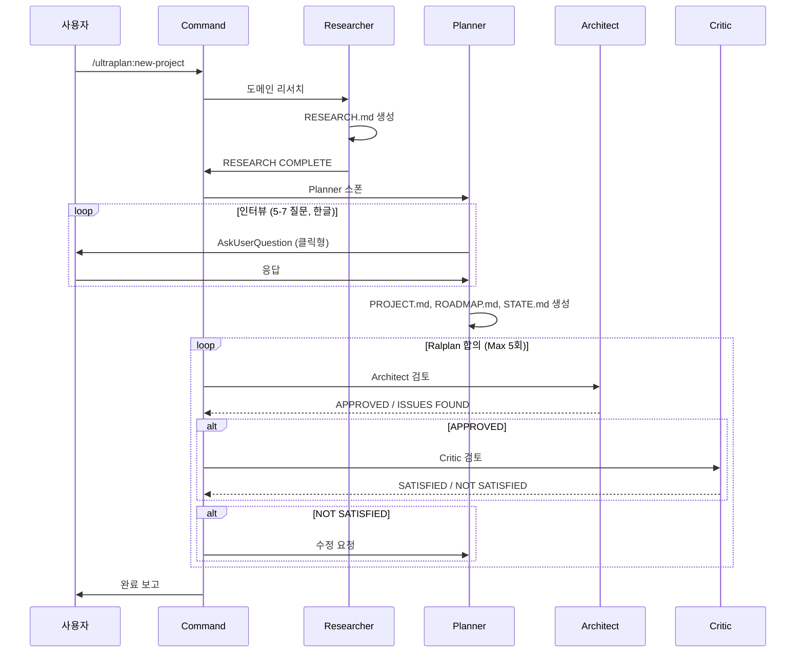
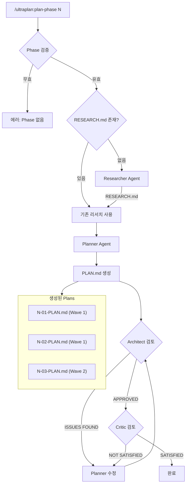
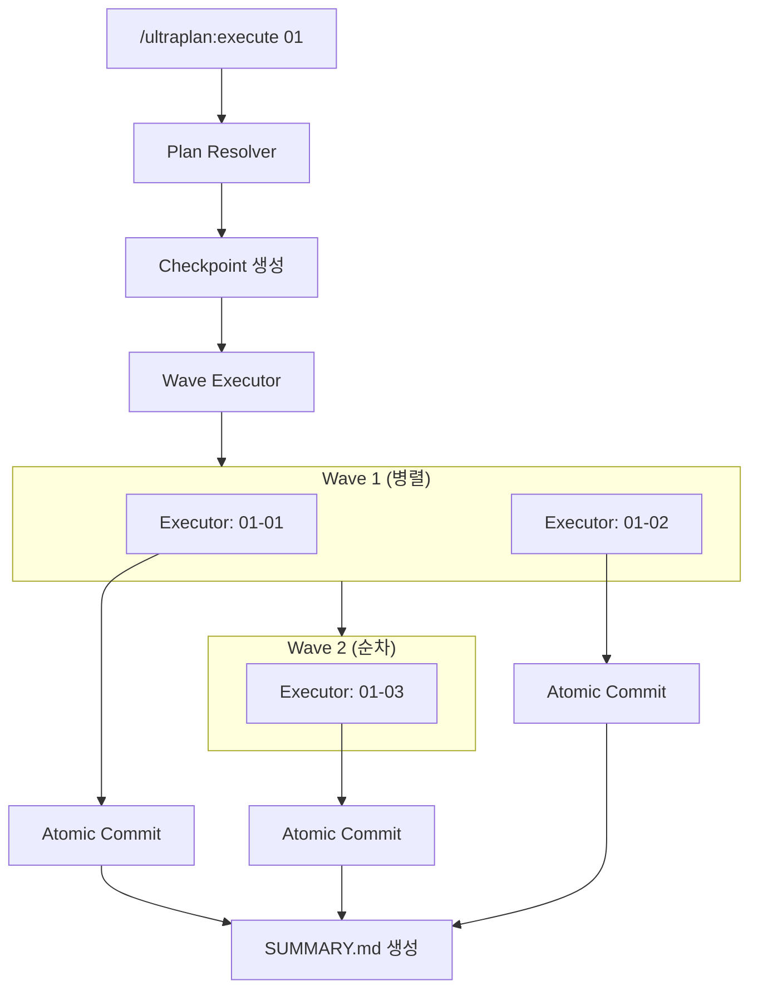

# Ultra Planner v2.0

GSD + OMC + OpenCode 패턴을 통합한 Claude Code용 계획-실행 오케스트레이션 시스템.

## 특징

### 핵심 기능
- **Research → Plan → Ralplan 워크플로우**: 리서치 후 계획, Architect + Critic 합의까지 검증
- **인터뷰 기반 계획**: Planner 에이전트가 한글로 질문하고 계획 수립
- **병렬 실행**: Wave 기반 태스크 병렬 처리 (Ultrapilot 패턴)
- **MCP 서버**: 50+ MCP 도구로 모든 기능 노출
- **에러 복구**: 자동 롤백 + 재시도 (Ralph Loop 패턴)
- **Atomic Commit**: 태스크별 자동 커밋

### v2.0 신규 기능
- **Complexity Estimator**: 태스크 복잡도 1-5 자동 추정 → 모델 라우팅
- **Delegation Categories**: 7개 카테고리 기반 에이전트 자동 선택
- **Swarm Pattern**: 다수 워커가 태스크 풀에서 병렬 클레이밍
- **Pipeline Pattern**: 에이전트 순차 체이닝 + 6개 내장 프리셋
- **Deviation Handling**: Executor 일탈 레벨별 처리
- **Spike Phase**: 불확실성 높은 태스크 시간 제한 탐색

## 설치

### 개인용 전역 설치 (권장)

```bash
# 1. 디렉토리 생성
mkdir -p ~/.claude/commands ~/.claude/agents ~/.claude/skills

# 2. 심볼릭 링크 생성
ln -sf /path/to/ultra-planning/.claude/commands/* ~/.claude/commands/
ln -sf /path/to/ultra-planning/.claude/agents/* ~/.claude/agents/
ln -sf /path/to/ultra-planning/.claude/skills/ultraplan ~/.claude/skills/

# 3. 확인
ls ~/.claude/commands/ultraplan*
```

### 프로젝트별 설치

```bash
# 특정 프로젝트에만 설치
cp -r /path/to/ultra-planning/.claude /your/project/
```

### MCP 서버 설정

다른 프로젝트에서 Ultra Planner 함수를 MCP 도구로 사용:

```json
// .mcp.json
{
  "mcpServers": {
    "ultra-planner": {
      "type": "stdio",
      "command": "npx",
      "args": ["tsx", "/home/ubuntu/code/ultra-planning/src/mcp-server.ts"]
    }
  }
}
```

#### MCP 도구 목록

| 카테고리 | 도구 | 설명 |
|----------|------|------|
| **Plan Sync** | `parse_plan`, `extract_task_mappings`, `get_execution_order` | PLAN.md 파싱 및 태스크 추출 |
| **Complexity** | `estimate_complexity`, `get_model_for_complexity`, `batch_estimate` | 복잡도 추정 + 모델 라우팅 |
| **Swarm** | `initialize_swarm`, `claim_swarm_task`, `complete_swarm_task` | 병렬 워커 조율 |
| **Pipeline** | `create_pipeline_preset`, `parse_pipeline_string`, `record_stage_result` | 순차 에이전트 체이닝 |
| **Delegation** | `detect_category`, `route_task`, `route_by_complexity` | 카테고리 기반 라우팅 |
| **Notepad** | `add_learning`, `add_decision`, `add_issue`, `get_wisdom` | 학습 기록 시스템 |

## 사용법

### 기본 워크플로우

```
┌─────────────────────────────────────────────────────────────┐
│  Ultra Planner 워크플로우                                    │
│                                                              │
│  1. RESEARCH — 프로젝트/페이즈 도메인 리서치                  │
│  2. PLAN — 인터뷰 + PROJECT.md, ROADMAP.md, PLAN.md 생성     │
│  3. RALPLAN — Architect + Critic 합의까지 검증               │
│  4. EXECUTE — Wave 기반 병렬 실행                            │
└─────────────────────────────────────────────────────────────┘
```

```bash
# 1. 새 프로젝트 시작 (Research → 인터뷰 → Ralplan 검증)
/ultraplan:new-project

# 2. Phase 계획 생성 (Research → Plan → Ralplan 검증)
/ultraplan:plan-phase 1

# 3. Plan 실행
/ultraplan:execute 01-01
```

### 슬래시 커맨드

| 명령어 | 설명 |
|--------|------|
| `/ultraplan:new-project` | 새 프로젝트 초기화 (Research → Plan → Ralplan) |
| `/ultraplan:plan-phase {N}` | Phase N의 PLAN.md 파일들 생성 (Research → Plan → Ralplan) |
| `/ultraplan:execute {plan}` | Plan 실행 (예: `01-01`, `02`) |
| `/ultraplan:status` | 현재 프로젝트 상태 확인 |

### 플래그

```bash
/ultraplan:new-project --skip-research    # 리서치 건너뛰기
/ultraplan:plan-phase 1 --skip-research   # 리서치 건너뛰기
/ultraplan:plan-phase 1 --skip-verify     # Ralplan 검증 건너뛰기
/ultraplan:plan-phase 1 --gaps            # 갭 클로저 모드
```

## 아키텍처

### 에이전트 구조

```
┌─────────────────────────────────────────────────────────────┐
│                         AGENTS                               │
├─────────────────────────────────────────────────────────────┤
│  Researcher (Opus)  │ 도메인 리서치, RESEARCH.md 생성        │
│  Planner (Opus)     │ 인터뷰, PROJECT/ROADMAP/PLAN.md 생성   │
│  Architect (Opus)   │ 계획 검토, 기술적 타당성 검증           │
│  Critic (Opus)      │ 가정 도전, 리스크 식별                  │
│  Executor (Sonnet)  │ 태스크 실행, 코드 작성                  │
└─────────────────────────────────────────────────────────────┘
```

### Ralplan 합의 루프

```
┌──────────────────────────────────────────────────────────────┐
│                    CONSENSUS LOOP (Max 5회)                   │
│                                                               │
│   ┌──────────┐    ┌───────────┐    ┌────────┐                │
│   │ Planner  │───▶│ Architect │───▶│ Critic │                │
│   └──────────┘    └───────────┘    └────────┘                │
│        ▲                               │                      │
│        │         NOT SATISFIED         │                      │
│        └───────────────────────────────┘                      │
│                                                               │
│   종료 조건: Architect APPROVED + Critic SATISFIED            │
└──────────────────────────────────────────────────────────────┘
```

### 시나리오 1: 새 프로젝트 초기화



### 시나리오 2: Phase 계획 생성



### 시나리오 3: Plan 실행 (Wave 병렬화)



## 디렉토리 구조

### 설치 파일 (공유됨)

```
.claude/
├── commands/                    # 슬래시 커맨드 정의
│   ├── ultraplan-new-project.md
│   ├── ultraplan-plan-phase.md
│   ├── ultraplan-execute.md
│   └── ultraplan-status.md
├── agents/                      # 에이전트 정의
│   ├── ultraplan-planner.md     # 인터뷰 + 계획 (한글)
│   ├── ultraplan-researcher.md  # 도메인 리서치
│   ├── ultraplan-architect.md   # 기술 검토
│   ├── ultraplan-critic.md      # 가정 도전
│   └── ultraplan-executor.md    # 태스크 실행
└── skills/ultraplan/            # 스킬 및 참조 문서
    ├── SKILL.md
    ├── templates/
    └── references/
```

### 프로젝트 계획 파일 (프로젝트별 독립)

```
your-project/
└── .planning/
    ├── PROJECT.md               # 프로젝트 정의
    ├── ROADMAP.md               # Phase 목록 + 진행 상황
    ├── STATE.md                 # 현재 상태
    └── phases/
        ├── 01-foundation/
        │   ├── 01-RESEARCH.md   # 도메인 리서치 결과
        │   ├── 01-01-PLAN.md    # 실행 계획
        │   ├── 01-01-SUMMARY.md # 실행 결과
        │   └── ...
        └── 02-feature/
            └── ...
```

### TypeScript 라이브러리 (src/)

```
src/
├── index.ts                # 메인 엔트리포인트
├── types.ts                # 타입 정의
├── mcp-server.ts           # MCP 서버 (도구 노출)
├── agents/                 # 에이전트 프롬프트 생성
├── context/                # 컨텍스트 수집
├── documents/              # 문서 템플릿 + 생성기
├── git/                    # Atomic commit
├── hooks/                  # 이벤트 훅
├── loops/                  # Ralph Loop
├── notepad/                # 학습 노트패드
├── orchestration/          # 키워드 감지, Ralplan, Ultrapilot
├── quality/                # 품질 파이프라인
├── recovery/               # 에러 복구 + 롤백
├── state/                  # 파일 기반 상태 관리
├── sync/                   # PLAN.md ↔ Tasks 동기화
└── tasks/                  # 태스크 관리
```

## 핵심 모듈

| 모듈 | 위치 | 기능 |
|------|------|------|
| **State Manager** | `src/state/` | 파일 기반 상태 관리, 이벤트, 체크포인트, 세션 격리 |
| **Documents** | `src/documents/` | PROJECT/ROADMAP/PLAN.md 템플릿 + 생성기 |
| **Agents** | `src/agents/` | Planner, Researcher, Architect, Critic, Executor 프롬프트 |
| **Orchestration** | `src/orchestration/` | 다중 오케스트레이션 패턴 |
| ├─ Keywords | `orchestration/keywords/` | 매직 키워드 감지 |
| ├─ Ralplan | `orchestration/ralplan/` | 반복 합의 루프 |
| ├─ Ultrapilot | `orchestration/ultrapilot/` | 병렬 실행 조율 |
| ├─ Swarm | `orchestration/swarm/` | 다수 워커 태스크 클레이밍 (v2.0) |
| ├─ Pipeline | `orchestration/pipeline/` | 순차 에이전트 체이닝 (v2.0) |
| ├─ Delegation | `orchestration/delegation/` | 카테고리 기반 라우팅 (v2.0) |
| ├─ Deviation | `orchestration/deviation/` | Executor 일탈 처리 |
| └─ Spike | `orchestration/spike/` | 불확실성 탐색 |
| **Complexity** | `src/complexity/` | 태스크 복잡도 추정 + 모델 라우팅 (v2.0) |
| **Sync** | `src/sync/` | PLAN.md ↔ Claude Tasks 동기화 |
| **Recovery** | `src/recovery/` | 에러 복구 + Git 롤백 + 선택적 롤백 |
| **Git** | `src/git/` | Atomic commit |
| **Ralph Loop** | `src/loops/ralph/` | 완료 감지 + 상태 관리 |
| **Notepad** | `src/notepad/` | 학습 노트, 결정 사항 기록 |
| **Quality** | `src/quality/` | LSP 진단, AST 분석, 코드 리뷰 |

## v2.0 신규 기능

### 복잡도 추정 및 모델 라우팅

태스크 설명과 파일 목록을 기반으로 복잡도를 자동 추정하고 적절한 모델을 선택합니다.

```typescript
import * as complexity from 'ultra-planner/complexity';
// 또는
import { estimateComplexity, getModelForComplexity, batchEstimate, COMPLEXITY_MODEL_MAP } from 'ultra-planner/complexity';

// 1. 단일 태스크 복잡도 추정
const result = estimateComplexity({
  taskDescription: 'Refactor authentication system',
  files: ['src/auth/index.ts', 'src/auth/jwt.ts', 'src/auth/middleware.ts']
});

console.log(result.complexity.level);    // 5 (1-5)
console.log(result.complexity.factors);  // ['refactor keyword', 'auth files', 'multiple files']
console.log(result.recommendedModel);    // 'opus'

// 2. 복잡도 레벨로 직접 모델 조회
const model = getModelForComplexity(3);  // 'sonnet'

// 3. 배치 추정 (여러 태스크 한번에)
const tasks = [
  { name: 'task1', action: 'Fix typo' },
  { name: 'task2', action: 'Refactor authentication' },
  { name: 'task3', action: 'Add button' }
];
const results = batchEstimate(tasks);
// Map { 'task1' => {...}, 'task2' => {...}, 'task3' => {...} }

// 4. 복잡도 → 모델 매핑 테이블
console.log(COMPLEXITY_MODEL_MAP);
// { 1: 'haiku', 2: 'haiku', 3: 'sonnet', 4: 'sonnet', 5: 'opus' }
```

**복잡도 추정 요소:**

| 요소 | 영향 |
|------|------|
| 키워드 (refactor, migrate, architect) | 복잡도 +1 |
| 키워드 (fix typo, rename, config) | 복잡도 -0.5 |
| 파일 수 > 3 | 복잡도 +0.5 |
| 파일 수 > 5 | 복잡도 +1 |
| auth/security 관련 파일 | 복잡도 +0.5 |

**복잡도 → 모델 매핑:**

| Level | 카테고리 | 모델 | 예시 |
|-------|----------|------|------|
| 1-2 | Quick | Haiku | 파일 찾기, 타이포 수정 |
| 3 | Standard | Sonnet | 함수 추가, 버그 수정 |
| 4 | Complex | Sonnet | 모듈 리팩토링 |
| 5 | Architectural | Opus | 시스템 재설계, 마이그레이션 |

### 세션 격리

에이전트 간 충돌 방지를 위한 세션 기반 태스크 클레이밍:

```typescript
import { createSession, claimTask } from 'ultra-planner';

const session = createSession({ name: 'Worker-1', agentRole: 'executor' });
const claimed = claimTask(session.id, 'task-01-01');
```

### Deviation 처리 (일탈 관리)

Executor가 계획에서 벗어날 때 레벨별 처리:

| Level | 조치 | 예시 |
|-------|------|------|
| 1 | 기록만 | 파일 추가, 작은 접근 변경 |
| 2 | Architect 승인 필요 | 의존성 추가, 성능 트레이드오프 |
| 3 | Plan 수정 트리거 | 범위 확장, 블로커 발견 |

```typescript
import { reportDeviation, submitArchitectVerdict } from 'ultra-planner';

// Executor가 일탈 보고
const deviation = reportDeviation(planPath, taskId, 'dependency_addition',
  'Added new npm package', 'Use built-in', 'Used axios', 'Built-in fetch lacks interceptors');

// Level 2는 Architect 승인 필요
submitArchitectVerdict(planPath, deviation.id, true, 'Acceptable tradeoff');
```

### Spike Phase (불확실성 처리)

불확실성이 높은 태스크를 위한 시간 제한 탐색:

```typescript
import { assessUncertainty, createSpike, completeSpike } from 'ultra-planner';

// 불확실성 평가
const assessment = assessUncertainty('Integrate with unknown external API', {
  hasExternalDependency: true,
  requiresResearch: true
});

if (assessment.uncertainty >= 7) {
  // Spike 생성 (기본 30분)
  const spike = createSpike(planPath, taskId,
    'API 통합 방법 조사',
    ['인증 방식은?', 'Rate limit은?', 'SDK 있나?']
  );

  // Spike 완료 시 결과 기록
  completeSpike(planPath, spike.id, {
    success: true,
    findings: ['OAuth 2.0 사용', 'SDK 없음, REST 직접 호출'],
    proceedWithTask: true,
    timeSpentMinutes: 25
  });
}
```

### Swarm 패턴 (병렬 워커)

여러 워커가 태스크 풀에서 작업을 클레이밍하며 병렬 실행:

```typescript
import {
  initializeSwarm,
  generateWorkerPrompt,
  generateOrchestratorPrompt,
  claimTask,
  completeTask,
  getSwarmStatus,
  DEFAULT_SWARM_CONFIG
} from 'ultra-planner';

// 1. Swarm 초기화 (PLAN.md에서 태스크 추출)
const state = await initializeSwarm('PLAN.md', { maxWorkers: 5 });
console.log('Session:', state.sessionId);
console.log('Tasks:', state.tasks.length);

// 2. 워커 프롬프트 생성 (모든 필드 선택적)
const workerPrompt = generateWorkerPrompt({
  worker: { id: 'worker-1', name: 'Worker-1', index: 0 },
  sessionId: state.sessionId,
  planPath: 'PLAN.md',
  model: 'sonnet',  // 선택적
  learnings: 'Use async/await for DB calls'  // 선택적
});

// 3. 오케스트레이터 프롬프트 생성
const orchestratorPrompt = generateOrchestratorPrompt('PLAN.md', state.sessionId, 5);

// 4. 태스크 클레이밍 및 완료
const claimed = claimTask(state.sessionId, 'worker-1', 'task-01');
if (claimed) {
  // 작업 수행 후 완료 보고
  completeTask(state.sessionId, 'worker-1', 'task-01', {
    success: true,
    output: 'Task completed',
    filesModified: ['src/auth.ts']
  });
}

// 5. 상태 확인
const status = getSwarmStatus(state.sessionId);
console.log('Completed:', status?.stats.completedTasks, '/', status?.stats.totalTasks);
```

**Swarm 설정:**

| 옵션 | 기본값 | 설명 |
|------|--------|------|
| `maxWorkers` | 5 | 최대 동시 워커 수 |
| `claimRetries` | 3 | 클레임 실패 시 재시도 횟수 |
| `workerTimeoutMs` | 300000 | 워커 타임아웃 (5분) |
| `autoReleaseStale` | true | 타임아웃된 태스크 자동 해제 |

### Pipeline 패턴 (순차 체이닝)

에이전트를 순차적으로 연결하여 데이터 전달:

```typescript
import {
  createPipelineFromPreset,
  parsePipelineString,
  createCustomPipeline,
  initializePipeline,
  startPipeline,
  recordStageResult,
  getCurrentStage,
  buildStagePrompt,
  getPipelineStatus,
  listPresets
} from 'ultra-planner';

// 1. 내장 프리셋 사용
const reviewPipeline = createPipelineFromPreset('review', 'Review auth module');
// review: explore → analyze → critique → fix

// 2. 문자열 파싱으로 커스텀 파이프라인
const customPipeline = parsePipelineString(
  'explore:haiku -> architect:opus -> executor:sonnet',
  'My Pipeline'
);

// 3. 프로그래매틱 커스텀 파이프라인
const advancedPipeline = createCustomPipeline(
  'Advanced Review',
  'Deep code analysis',
  [
    { name: 'explore', agent: 'explore-medium', model: 'sonnet', promptTemplate: 'Find: {input}' },
    { name: 'analyze', agent: 'architect', model: 'opus', promptTemplate: 'Analyze:\n{input}' },
  ],
  { initialInput: 'Authentication system', stopOnFailure: true }
);

// 4. 파이프라인 실행
const state = initializePipeline(reviewPipeline);
startPipeline(state.sessionId);

// 5. 스테이지별 실행
const current = getCurrentStage(state.sessionId);
if (current) {
  const prompt = buildStagePrompt(current.stage, current.input);
  // Task tool로 에이전트 실행 후 결과 기록
  recordStageResult(state.sessionId, {
    stageName: current.stage.name,
    success: true,
    output: 'Found files: auth.ts, jwt.ts',
    executionTimeMs: 1500
  });
}

// 6. 상태 확인
const status = getPipelineStatus(state.sessionId);
console.log('Stage:', status?.currentStage, '/', status?.totalStages);
console.log('Status:', status?.status);

// 7. 프리셋 목록
console.log('Available presets:', listPresets().map(p => p.name));
```

**내장 프리셋:**

| 프리셋 | 단계 | 용도 |
|--------|------|------|
| `review` | explore → analyze → critique → fix | 코드 리뷰 |
| `implement` | plan → execute → test | 기능 구현 |
| `debug` | explore → analyze → fix | 디버깅 |
| `research` | researcher + explore (병렬) → synthesize → document | 리서치 |
| `refactor` | explore → plan → execute → verify | 리팩토링 |
| `security` | explore → audit → fix → re-audit | 보안 검토 |

### Delegation 카테고리

태스크 특성에 따른 자동 라우팅:

```typescript
import {
  detectCategory,
  routeTask,
  routeByComplexity,
  categoryFromComplexity,
  getCategoryConfig,
  getAgentForCategory,
  getModelForCategory,
  needsHighTierModel,
  listCategories,
  generateExecutorLoopPrompt,
  generateHeartbeatProtocol
} from 'ultra-planner';

// 1. 카테고리 감지 (키워드 기반)
const category = detectCategory('Debug the race condition'); // 'ultrabrain'
const uiCategory = detectCategory('Create UI component');    // 'visual-engineering'
const docCategory = detectCategory('Write API documentation'); // 'writing'

// 2. 태스크 라우팅 (컨텍스트 힌트 지원)
const route = routeTask('Create UI component', {
  contextHints: { isUI: true },
  preferredCategory: undefined,  // 자동 감지
  forceModel: undefined          // 자동 선택
});
console.log(route.category);  // 'visual-engineering'
console.log(route.agent);     // 'designer-high'
console.log(route.model);     // 'opus'

// 3. 복잡도 기반 라우팅
const complexRoute = routeByComplexity('Refactor auth system', [
  'src/auth/index.ts',
  'src/auth/jwt.ts',
  'src/auth/middleware.ts'
]);
console.log(complexRoute.complexity);  // 4-5
console.log(complexRoute.category);    // 'complex' or 'ultrabrain'

// 4. 카테고리 설정 조회
const config = getCategoryConfig('ultrabrain');
console.log(config.model.tier);           // 'opus'
console.log(config.model.thinkingBudget); // 'max'

// 5. 고급 모델 필요 여부
const needsOpus = needsHighTierModel('Debug the race condition'); // true
const simple = needsHighTierModel('Find the file');               // false

// 6. Executor Loop 프롬프트 생성
const loopPrompt = generateExecutorLoopPrompt({
  workerId: 'worker-1',
  sessionId: 'session-123',
  planPath: 'PLAN.md',
  learnings: 'Use async/await for DB calls'
});
```

**카테고리 → 에이전트 매핑:**

| 카테고리 | 에이전트 | 모델 | Temperature | Thinking | 용도 |
|----------|----------|------|-------------|----------|------|
| `quick` | explore | Haiku | 0.1 | low | 간단 조회, 파일 찾기 |
| `standard` | executor | Sonnet | 0.3 | medium | 일반 구현, 기능 추가 |
| `complex` | executor-high | Opus | 0.3 | high | 복잡한 변경, 리팩토링 |
| `ultrabrain` | architect | Opus | 0.3 | max | 분석, 아키텍처, 디버깅 |
| `visual-engineering` | designer-high | Opus | 0.7 | high | UI/UX, 프론트엔드 |
| `artistry` | architect-medium | Sonnet | 0.9 | medium | 창의적 문제 해결 |
| `writing` | writer | Haiku | 0.5 | medium | 문서화, README |

**카테고리 감지 키워드:**

| 카테고리 | 트리거 키워드 |
|----------|---------------|
| `quick` | find, locate, where is, what is, show me, list |
| `standard` | add, create, implement, update, modify, change |
| `complex` | refactor, redesign, restructure, migrate, overhaul |
| `ultrabrain` | debug, analyze, architect, design, investigate, why, how |
| `visual-engineering` | ui, ux, frontend, component, style, design, layout |
| `artistry` | creative, brainstorm, ideas, alternatives, explore |
| `writing` | document, write, explain, describe, comment, readme |

### 고급 롤백

선택적 롤백 및 Phase 단위 롤백:

```typescript
import { previewRollback, selectiveRollback, rollbackToPhase, completePhase } from 'ultra-planner';

// Phase 완료 시 태그 생성
completePhase(3, 'Adaptability'); // git tag phase-3-complete

// 롤백 미리보기
const preview = previewRollback('checkpoint-id');

// 선택적 롤백 (상태만, 소스 제외)
selectiveRollback('checkpoint-id', { rollbackState: true, rollbackSource: false });

// Phase 단위 롤백
rollbackToPhase(2, { rollbackSource: true, dryRun: true });
```

## API 예시

### 상태 관리

```typescript
import { readState, writeState, createCheckpoint } from 'ultra-planner';

// 상태 읽기/쓰기
const state = await readState('my-state');
await writeState('my-state', { phase: 1, status: 'in_progress' });

// 체크포인트
await createCheckpoint('before-risky-operation');
await rollbackToCheckpoint('before-risky-operation');
```

### 문서 생성

```typescript
import { generateProjectMd, generateRoadmapMd, generatePlanMd } from 'ultra-planner';

// PROJECT.md 생성
const projectMd = generateProjectMd({
  name: 'My Project',
  description: 'A cool project',
  requirements: [{ id: 'REQ-01', description: 'Feature A' }]
});

// PLAN.md 파싱
const plan = await parsePlanMd('.planning/phases/01-foundation/01-01-PLAN.md');
```

### 노트패드 (학습 기록)

```typescript
import { initPlanNotepad, addLearning, addDecision } from 'ultra-planner';

// 노트패드 초기화
await initPlanNotepad('my-plan');

// 학습 기록
await addLearning('my-plan', 'TypeScript strict mode requires explicit return types');

// 결정 사항 기록
await addDecision('my-plan', 'Use Zod for runtime validation instead of io-ts');
```

## 빌드 및 테스트

```bash
# 의존성 설치
npm install

# 빌드
npm run build

# 테스트 (80 tests)
npm test

# 개발 모드 (watch)
npm run dev

# MCP 서버 실행
npx tsx src/mcp-server.ts
```

### 테스트 커버리지

| 모듈 | 테스트 수 |
|------|----------|
| `delegation/manager` | 22 |
| `pipeline/manager` | 16 |
| `swarm/manager` | 15 |
| `complexity/estimator` | 10 |
| `integration/workflow` | 7 |
| `integration/error-recovery` | 10 |
| **Total** | **80** |

## 아키텍처 원칙

1. **Research First**: 계획 전 항상 도메인 리서치
2. **Ralplan 합의**: Architect + Critic 합의 없이 실행 없음
3. **문서가 곧 프롬프트**: PLAN.md는 실행자에게 직접 전달되는 지시문
4. **Goal-Backward**: 목표에서 역산하여 Phase/Task 도출
5. **Wave 기반 병렬화**: 의존성 없는 태스크는 병렬 실행
6. **Atomic Commit**: 태스크 완료마다 자동 커밋
7. **파일 기반 상태**: 에이전트 간 상태 공유는 파일로

## 참조 프로젝트

- [oh-my-claudecode](https://github.com/anthropics/oh-my-claudecode) - OMC 패턴
- [get-shit-done](https://github.com/anthropics/get-shit-done) - GSD 문서 체계
- [oh-my-opencode](https://github.com/anthropics/oh-my-opencode) - Ralph Loop, Atlas 패턴

## 라이선스

MIT

---

*Ultra Planner v2.0.0 - 2026-01-31*

**주요 변경사항 (v2.0):**
- ✅ Complexity Estimator (태스크 복잡도 → 모델 자동 선택)
- ✅ Delegation Categories (7개 카테고리 기반 에이전트 라우팅)
- ✅ Swarm Pattern (병렬 워커 태스크 클레이밍)
- ✅ Pipeline Pattern (6개 프리셋 + 커스텀 체이닝)
- ✅ MCP Server (50+ 도구 노출)
- ✅ 80 Unit Tests
